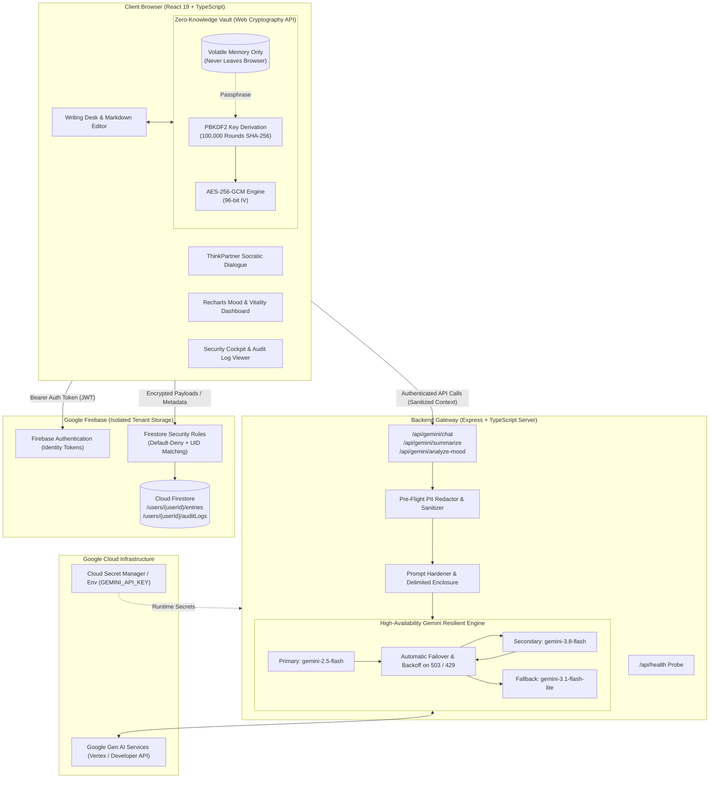

# CipherThought 🛡️🧠

> **Enterprise-Grade, Zero-Trust Private Journaling & Brainstorming Companion powered by Gemini AI and Client-Side Zero-Knowledge Encryption.**

[](https://www.typescriptlang.org/)
[](https://react.dev/)
[](https://tailwindcss.com/)
[](https://expressjs.com/)
[](https://ai.google.dev/)
[](https://firebase.google.com/)
[](https://opensource.org/licenses/MIT)

CipherThought is a security-first reflective intelligence platform designed for confidential personal writing, executive decision debriefs, and strategic brainstorming. By pairing **client-side AES-256-GCM zero-knowledge encryption** with **server-side isolated Gemini AI proxies**, CipherThought guarantees that your thoughts remain strictly private, tamper-proof, and isolated to your authenticated identity.

---

## 📑 Table of Contents

- [System Architecture](#-system-architecture)
- [Core Security Directives (SecOps-Gov-01)](#-core-security-directives-secops-gov-01)
- [Key Features](#-key-features)
- [Technology Stack](#-technology-stack)
- [Directory Structure](#-directory-structure)
- [Getting Started](#-getting-started)
  - [Prerequisites](#prerequisites)
  - [Environment Configuration](#environment-configuration)
  - [Installation & Local Execution](#installation--local-execution)
- [API Reference](#-api-reference)
- [Database & Security Rules](#-database--security-rules)
- [Build & Deployment](#-build--deployment)
- [Security Auditing & Threat Modeling](#-security-auditing--threat-modeling)
- [License](#-license)

---

## 🏛️ System Architecture

CipherThought strictly separates client-side cryptography, authenticated proxy gateways, and cloud data stores to establish a zero-trust perimeter.



### Data Flow Lifecycle
1. **Client Authors Content**: Notes are entered into the markdown editor.
2. **Optional Zero-Knowledge Encryption**: If vault protection is activated, plaintext is encrypted locally via **AES-256-GCM** using a key derived from the user's master passphrase with **PBKDF2 (100,000 iterations)**. Ciphertext, salt, and IV are saved; plaintext never touches network payloads or databases.
3. **AI Augmentation**: ThinkPartner chats and summary extraction are dispatched to the server-side Express gateway. The client never holds `GEMINI_API_KEY`.
4. **Prompt Hardening**: Server wraps user thoughts in delimited boundary tags (`<user_journal_entry>`), scrubs detectable PII patterns, and applies system role constraints before invoking Gemini.
5. **Multi-Model Failover**: If Gemini encounters high upstream demand (`503 UNAVAILABLE` or `429`), the server automatically recovers through fallback models with progressive backoff.
6. **Multi-Tenant Persistence**: Entries and audit telemetry are persisted directly to Firestore under `/users/{userId}/**`, enforced by Firestore Security Rules.

---

## 🔒 Core Security Directives (SecOps-Gov-01)

CipherThought adheres to the Google AI Studio Enterprise Security Directives:

| Directive | Implementation Detail |
| :--- | :--- |
| **STRIDE Threat Modeling** | Every state-changing action, cryptographic event, and AI interaction produces structured audit records. |
| **Zero Secret Exposure** | `GEMINI_API_KEY` is strictly server-side. No API keys or service account credentials exist in client bundles. |
| **Multi-Tenant Isolation** | Database paths are strictly namespaced under `/users/{userId}/**`. Cross-tenant queries are blocked by default-deny security rules. |
| **Zero-Knowledge Vault** | Built with native `window.crypto.subtle`. Keys reside purely in volatile RAM and cannot be accessed by servers or cloud operators. |
| **Prompt Sandboxing** | Inputs to LLMs are sanitized and contained within explicit delimiter blocks to defeat indirect prompt injection and extraction. |

---

## ✨ Key Features

### 1. ✍️ Focused Writing Desk & Markdown Editor
- Rich markdown support with split-pane live rendering.
- Word count, reading time, and real-time word-density telemetry.
- Category taxonomies: *Personal*, *Work*, *Reflective*, *Ideas*, *Gratitude*, *Strategic*.
- Tag management with automated typeahead suggestions.

### 2. 🤖 Interactive Gemini ThinkPartner
- Real-time conversational sounding board right beside your entries.
- **5 Cognitive Thinking Modes**:
  - **Empathetic**: Compassionate, validating listening.
  - **Socratic Inquiry**: Probes hidden assumptions with deep questioning.
  - **Strategic Clarity**: Identifies high-leverage outcomes and eliminates noise.
  - **Stoic & CBT**: Reframes emotional distress into actionable locus of control.
  - **Lateral Brainstorming**: Unlocks divergent, non-obvious ideas.

### 3. 📑 Automated Executive Synthesis & Breakthrough Extraction
- Distills long freeform thoughts and chat histories into:
  - **Executive Summary** (1–2 sentence essence).
  - **Key Insights** (synthesized breakthroughs).
  - **Action Steps** (concrete next actions).
  - **Cognitive Reframe** (positive mental model shift).
  - **Auto-Generated Tags**.

### 4. 📊 Psychometric Mood & Vitality Dashboard
- Recharts-powered analytics evaluating sentiment trends over time.
- 4-dimensional emotional spectrum scoring: **Joy**, **Calm**, **Clarity**, and **Vital Energy** (0–100).
- Dominant mood classification with visual badge indicators.

### 5. 🔐 Zero-Knowledge Client Cryptographic Vault
- One-click encryption toggle per entry using client-side Web Cryptography.
- Encrypted entries can only be decrypted in-browser with your secret passphrase.
- Protected entries display an encrypted shield badge in your archive.

### 6. 🛡️ Security Cockpit & Audit Console
- Real-time zero-trust compliance inspector.
- Live verification of encryption cipher states, token expiration, and secret protection.
- Structured audit event log showing timestamped records of logins, encryption cycles, AI calls, and deletions.

---

## 🛠️ Technology Stack

- **Frontend**: React 19, TypeScript, Vite 6, Tailwind CSS v4, Motion, Lucide React, Recharts.
- **Backend**: Node.js, Express 4, `tsx` (dev runtime), `esbuild` (production CJS bundling).
- **AI Engine**: Google Gen AI SDK (`@google/genai`), Google Gemini Flash models.
- **Security & Cryptography**: Web Cryptography API (`SubtleCrypto`: PBKDF2, AES-256-GCM, SHA-256).
- **Authentication & Database**: Firebase Authentication (Google & Email/Password), Cloud Firestore.

---

## 📁 Directory Structure

```text
├── .env.example                 # Environment template for required secrets
├── firestore.rules              # Zero-trust multi-tenant Firestore security rules
├── metadata.json                # AI Studio application capabilities manifest
├── package.json                 # Dependency definitions and build pipelines
├── server.ts                    # Express API server with resilient Gemini proxies
├── vite.config.ts               # Vite configuration with Tailwind CSS v4 plugin
├── public/                      # Static assets and icons
└── src/
    ├── main.tsx                 # React application entrypoint
    ├── App.tsx                  # Root layout, navigation router & global state
    ├── index.css                # Tailwind CSS v4 entrypoint
    ├── types.ts                 # TypeScript domain entities and interfaces
    ├── components/
    │   ├── Navbar.tsx           # Global header with vault status and auth trigger
    │   ├── JournalEditor.tsx    # Dual-column writing desk & ThinkPartner panel
    │   ├── JournalList.tsx      # Filterable, searchable journal archive
    │   ├── MoodDashboard.tsx    # Recharts mood and psychometric visualizer
    │   ├── AuthModal.tsx        # Firebase authentication modal
    │   ├── EntryDetailModal.tsx # Full entry reader with client-side decryption
    │   └── SecurityCockpitModal.tsx # Real-time compliance inspector & audit logs
    ├── lib/
    │   ├── cryptoVault.ts       # Web Cryptography API AES-256-GCM / PBKDF2 vault
    │   └── firebase.ts          # Firebase SDK initialization and Firestore helpers
    └── utils/
        └── moodAnalyzer.ts      # Client-side sentiment heuristics and color mappings
```

---

## 🚀 Getting Started

### Prerequisites
- **Node.js**: v18.0.0 or higher
- **npm** or **bun**: Node package manager
- **Google Gemini API Key**: [Get an API Key from Google AI Studio](https://aistudio.google.com/)
- **Firebase Project**: A Firebase project with Authentication & Cloud Firestore enabled.

### Environment Configuration

Create a `.env` file in the root directory based on `.env.example`:

```bash
cp .env.example .env
```

Populate the required keys:

```env
# Required for Gemini AI capabilities
GEMINI_API_KEY="your-gemini-api-key"

# Optional: Host URL (auto-injected in production environments)
APP_URL="http://localhost:3000"
```

> **Note**: Firebase configuration is maintained in `firebase-applet-config.json` or can be configured directly in `src/lib/firebase.ts`.

### Installation & Local Execution

1. **Install dependencies**:
   ```bash
   npm install
   ```

2. **Start development server**:
   ```bash
   npm run dev
   ```
   The application will boot at `http://localhost:3000` with hot-reloading Vite middleware mounted inside the Express server.

3. **Verify type safety and linting**:
   ```bash
   npm run lint
   ```

---

## 📡 API Reference

All AI endpoints run through server-side authenticated route handlers to isolate credentials:

### `POST /api/gemini/chat`
Invokes the ThinkPartner conversational assistant with system role prompting and cognitive mode framing.
- **Request Body**:
  ```json
  {
    "messages": [
      { "role": "user", "content": "I am struggling with deciding between two career opportunities." }
    ],
    "currentContent": "Optional current draft text",
    "sessionMode": "strategic"
  }
  ```
- **Response**: `{ "reply": "Let us break down the primary decision criteria..." }`

### `POST /api/gemini/summarize`
Generates an executive synthesis, extracts key breakthroughs, action items, tags, and evaluates psychometric sentiment.
- **Request Body**:
  ```json
  {
    "title": "Quarterly Strategy Debrief",
    "content": "Detailed entry text...",
    "dialogueHistory": [ ... ]
  }
  ```
- **Response**:
  ```json
  {
    "summary": "Executive summary of the session...",
    "keyInsights": ["Insight 1", "Insight 2"],
    "actionSteps": ["Action item 1"],
    "suggestedTags": ["Strategy", "Planning"],
    "cognitiveReframe": "Empowering reframing perspective",
    "sentimentScore": 85,
    "primaryMood": "Determined",
    "emotionalDimensions": { "joy": 75, "calm": 80, "clarity": 90, "energy": 85 }
  }
  ```

### `POST /api/gemini/analyze-mood`
Performs lightweight psychometric sentiment evaluation across emotional dimensions.

### `POST /api/security/scrub-pii`
Pre-flight endpoint that scans text for accidentally pasted sensitive credentials, social security numbers, and email patterns.

### `GET /api/health`
System health probe verifying Gemini API connectivity and service readiness.

---

## 🗄️ Database & Security Rules

CipherThought enforces strict tenant isolation using Firebase Cloud Firestore. Documents are partitioned strictly by `userId`:

```text
/users/{userId}
   ├── entries/{entryId}     # Journal documents and encrypted payloads
   └── auditLogs/{logId}     # Client-side and server-side security event logs
```

### Firestore Security Rules (`firestore.rules`)

```javascript
rules_version = '2';
service cloud.firestore {
  match /databases/{database}/documents {
    // Default Deny: Zero-Trust baseline
    match /{document=**} {
      allow read, write: if false;
    }

    // Strict multi-tenant isolation: Users can strictly access ONLY their own documents
    match /users/{userId} {
      allow read, write: if request.auth != null && request.auth.uid == userId;

      match /entries/{entryId} {
        allow read, write: if request.auth != null && request.auth.uid == userId;
      }

      match /auditLogs/{logId} {
        allow read, write: if request.auth != null && request.auth.uid == userId;
      }

      match /{allSubPaths=**} {
        allow read, write: if request.auth != null && request.auth.uid == userId;
      }
    }
  }
}
```

---

## 📦 Build & Deployment

CipherThought compiles into a self-contained, container-ready single-binary deployment:

```bash
# Compile frontend with Vite and bundle server with esbuild
npm run build

# Launch production server
npm run start
```

### Container / Cloud Run Compatibility
- Port: Automatically binds to `0.0.0.0:3000`.
- Production bundle: Output to `dist/server.cjs` via `esbuild` with `--packages=external` to bypass Node ES module resolution issues.
- Static assets: Served directly from `dist/` with SPA fallback.

---

## 🔍 Security Auditing & Threat Modeling

CipherThought incorporates an interactive **Security Cockpit** accessible via the top navigation bar. It offers real-time visibility into:

1. **Authentication Token Integrity**: Verifies active JWT expiration and UID binding.
2. **Cryptographic Suite Check**: Validates the availability and randomness source of `window.crypto.subtle`.
3. **Secret Isolation Confirmation**: Confirms `GEMINI_API_KEY` is not present in client JavaScript runtime globals.
4. **Structured Audit Logs**: Inspect all state-changing activities with exact timestamps, event types, and SHA-256 telemetry.

---

## 📄 License

This project is licensed under the [MIT License](LICENSE).
